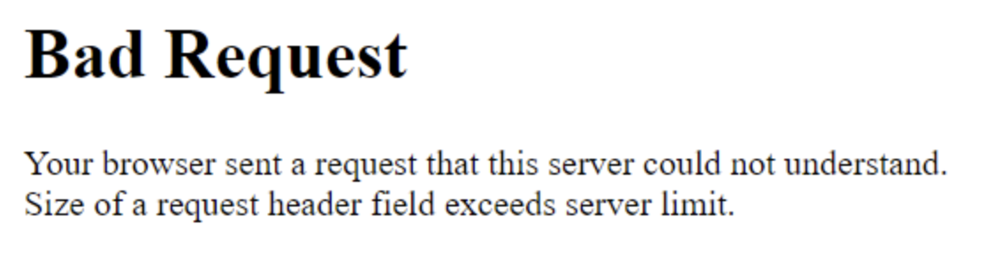

# 請求標頭欄位的大小超過伺服器限制

## 說明 {#description}

.lf-progress { width： 100%； height： 4px； border-radius： 3px； cursor： pointer }<br>.lf-progress：focus {大綱：無；邊框：無}<br>.lf-progress：：-moz-range-track { cursor： pointer； background： none； border： none； outline： none }<br>.lf-progress：：-webkit-slider-thumb {高度： 13px；寬度： 13px；邊框： 0；邊框半徑： 50%；背景： rgba(15， 204， 206， 1)；cursor： pointer }<br>.lf-progress：：-moz-range-thumb {高度： 13px；寬度： 13px；邊框： 0；邊框半徑： 50%；背景： rgba(15， 204， 206， 1)；游標：指標}<br>.lf-progress：：-ms-track { width： 100%；height： 3px； cursor： pointer； background： rgba(0， 0， 0， 0)； border-color： rgba(0， 0， 0)； color： rgba(0， 0， 0) }<br>.lf-progress：-ms-fill-lower {背景： rgba(204， 204， 1)；border-radius： 3px }<br>.lf-progress：-ms-fill-upper {背景： rgba(204， 204， 1)；邊框半徑： 3px }<br>.lf-progress：：-ms-thumb {邊框： 0；高度： 15px；寬度： 15px；邊框半徑： 50%；背景： rgba(15， 204， 206， 1)；游標：指標}<br>`.lf-progress:focus::-ms-fill-lower` { background： rgba(204， 204， 204， 1) }<br>`.lf-progress:focus::-ms-fill-upper` { background： rgba(204， 204， 204， 1) }<br>.lf-player-container ：focus {大綱： 0 }<br>.lf-popover { position： relative }<br>.lf-popover-content { display： inline-block； position： absolute； opacity： 1； visible： visible； translate： (0， -10px)； box-shadow： 0 2px 5px rgba(0， 0， 0， 0.26)； transition： all 0.3s cubic-bezier(0.75， -0.02， 0.2， 0.97) }<br>.lf-popover-content.hidden {不透明度： 0；可見度：隱藏；轉換： translate(0， 0) }<br>.lf-player-btn-container { display： flex； align-items： center }<br>.lf-player-btn { cursor： pointer； width： 14px }<br>.lf-player-btn.active { }<br>.lf-popover { position： relative }<br>.lf-popover-content { display： inline-block； position： absolute； background-color： rgba(255， 255， 1)； opacity： 1； translation： translate(0， -10px)； box-shadow： 0 2px 5px rgba(0， 0， 0， 0.26)； transition： all 0.3s cubic-bezier(0.75， -0.02， 0.97)； padding： 10px }<br>.lf-popover-content.hidden {不透明度： 0；可見度：隱藏；轉換： translate(0， 0) }<br>.lf-arrow { position： absolute； z-index： -1； content： &quot;&quot;； bottom： -9px； border-style： solid； border-width： 10px 10px 0 }<br>.lf-left-align， .lf-left-align .lfarrow {左： 0；右： unset }<br>.lf-right-align， .lf-right-align .lf-arrow {右： 0；左： unset }<br>.lf-text-input {邊框：1px solid rgba(204， 204， 1)；邊框半徑：5px；邊框間距：3px；寬度：60px；邊距：0 }<br>.lf-color-picker { display： flex； flex-direction： row； justify-content： space-between； height： 90px }<br>.lf-color-selectors { display： flex； flex-direction： column； justify-content： space-between }<br>.lf-color-component { display： flex； flex-direction： row； font-size： 12px； align-items： center； justify-content： center }<br>.lf-color-component strong {寬度： 40px }<br>.lf-color-component輸入`[` type=&quot;range&quot;`]`  { margin： 0 0 0 10px }<br>.lf-color-component輸入`[` type=&quot;number&quot;`]`  { width： 50px； margin： 0 0 0 10px }<br>.lf-color-preview { font-size： 12px； display： flex； flex-direction： column； align-items： center； justify-content： space-between； padding-left： 5px }<br>.lf-preview {高度： 60px；寬度： 60px }<br>.lf-pover-snapshot { width： 150px }<br>.lf-popover-snapshot h5 { margin： 5px 0 10px； font-size： 0.75rem }<br>.lf-popover-snapshot a { display： block； text-decoration： none }<br>.lf-popover-snapshot a：before { content： &quot;⥼&quot;；右邊界： 5px }<br>.lf-popover-snapshot .lf-note { display： block； margin-top： 10px； color： rgba(153， 153， 1) }<br>.lf-player-controls>div { margin-right： 5px； margin-left： 5px }<br>.lf-player-controls>div：first-child {左邊界： 0 }<br>.lf-player-controls>div：last-child {右邊界： 0 }.go4109123758 { z-index： 9999 }<br>.go4109123758>\* { pointer-events： auto }<br>
<b>說明</b> ：


開啟頁面時，使用者可能會收到「<b>錯誤請求</b>&quot;訊息的回應

&quot;<b>請求標頭欄位的大小超過伺服器限制</b>&quot;





## 解決方法 {#resolution}

.lf-progress {<br>  -webkit-appearance: none;<br>  -moz-apperance: none;<br>  width: 100%;<br>  /\* margin: 0 10px; \*/<br>  height: 4px;<br>  border-radius: 3px;<br>  cursor: pointer;<br>}<br>.lf-progress:focus {<br>  outline: none;<br>  border: none;<br>}<br>.lf-progress::-moz-range-track {<br>  cursor: pointer;<br>  background: none;<br>  border: none;<br>  outline: none;<br>}<br>.lf-progress::-webkit-slider-thumb {<br>  -webkit-appearance: none !important;<br>  height: 13px;<br>  width: 13px;<br>  border: 0;<br>  border-radius: 50%;<br>  background: #0fccce;<br>  cursor: pointer;<br>}<br>.lf-progress::-moz-range-thumb {<br>  -moz-appearance: none !important;<br>  height: 13px;<br>  width: 13px;<br>  border: 0;<br>  border-radius: 50%;<br>  background: #0fccce;<br>  cursor: pointer;<br>}<br>.lf-progress::-ms-track {<br>  width: 100%;<br>  height: 3px;<br>  cursor: pointer;<br>  background: transparent;<br>  border-color: transparent;<br>  color: transparent;<br>}<br>.lf-progress::-ms-fill-lower {<br>  background: #ccc;<br>  border-radius: 3px;<br>}<br>.lf-progress::-ms-fill-upper {<br>  background: #ccc;<br>  border-radius: 3px;<br>}<br>.lf-progress::-ms-thumb {<br>  border: 0;<br>  height: 15px;<br>  width: 15px;<br>  border-radius: 50%;<br>  background: #0fccce;<br>  cursor: pointer;<br>}<br>`.lf-progress:focus::-ms-fill-lower` {<br>  background: #ccc;<br>}<br>`.lf-progress:focus::-ms-fill-upper` {<br>  background: #ccc;<br>}<br>.lf-player-container :focus {<br>  outline: 0;<br>}<br>.lf-popover {<br>  position: relative;<br>}<br><br>.lf-popover-content {<br>  display: inline-block;<br>  position: absolute;<br>  opacity: 1;<br>  visibility: visible;<br>  transform: translate(0, -10px);<br>  box-shadow: 0 2px 5px 0 rgba(0, 0, 0, 0.26);<br>  transition: all 0.3s cubic-bezier(0.75, -0.02, 0.2, 0.97);<br>}<br><br>.lf-popover-content.hidden {<br>  opacity: 0;<br>  visibility: hidden;<br>  transform: translate(0, 0px);<br>}<br><br>.lf-player-btn-container {<br>  display: flex;<br>  align-items: center;<br>}<br>.lf-player-btn {<br>  cursor: pointer;<br>  fill: #999;<br>  width: 14px;<br>}<br><br>.lf-player-btn.active {<br>  fill: #555;<br>}<br><br>.lf-popover {<br>  position: relative;<br>}<br><br>.lf-popover-content {<br>  display: inline-block;<br>  position: absolute;<br>  background-color: #ffffff;<br>  opacity: 1;<br><br>  transform: translate(0, -10px);<br>  box-shadow: 0 2px 5px 0 rgba(0, 0, 0, 0.26);<br>  transition: all 0.3s cubic-bezier(0.75, -0.02, 0.2, 0.97);<br>  padding: 10px;<br>}<br><br>.lf-popover-content.hidden {<br>  opacity: 0;<br>  visibility: hidden;<br>  transform: translate(0, 0px);<br>}<br><br>.lf-arrow {<br>  position: absolute;<br>  z-index: -1;<br>  content: &#39;&#39;;<br>  bottom: -9px;<br>  border-style: solid;<br>  border-width: 10px 10px 0px 10px;<br>}<br><br>.lf-left-align,<br>.lf-left-align .lfarrow {<br>  left: 0;<br>  right: unset;<br>}<br><br>.lf-right-align,<br>.lf-right-align .lf-arrow {<br>  right: 0;<br>  left: unset;<br>}<br><br>.lf-text-input {<br>  border: 1px #ccc solid;<br>  border-radius: 5px;<br>  padding: 3px;<br>  width: 60px;<br>  margin: 0;<br>}<br><br>.lf-color-picker {<br>  display: flex;<br>  flex-direction: row;<br>  justify-content: space-between;<br>  height: 90px;<br>}<br><br>.lf-color-selectors {<br>  display: flex;<br>  flex-direction: column;<br>  justify-content: space-between;<br>}<br><br>.lf-color-component {<br>  display: flex;<br>  flex-direction: row;<br>  font-size: 12px;<br>  align-items: center;<br>  justify-content: center;<br>}<br><br>.lf-color-component strong {<br>  width: 40px;<br>}<br><br>.lf-color-component input`[` type=&#39;range&#39;`]`  {<br>  margin: 0 0 0 10px;<br>}<br><br>.lf-color-component input`[` type=&#39;number&#39;`]`  {<br>  width: 50px;<br>  margin: 0 0 0 10px;<br>}<br><br>.lf-color-preview {<br>  font-size: 12px;<br>  display: flex;<br>  flex-direction: column;<br>  align-items: center;<br>  justify-content: space-between;<br>  padding-left: 5px;<br>}<br><br>.lf-preview {<br>  height: 60px;<br>  width: 60px;<br>}<br><br>.lf-popover-snapshot {<br>  width: 150px;<br>}<br>.lf-popover-snapshot h5 {<br>  margin: 5px 0 10px 0;<br>  font-size: 0.75rem;<br>}<br>.lf-popover-snapshot a {<br>  display: block;<br>  text-decoration: none;<br>}<br>.lf-popover-snapshot a:before {<br>  content: &#39;⥼&#39;;<br>  margin-right: 5px;<br>}<br>.lf-popover-snapshot .lf-note {<br>  display: block;<br>  margin-top: 10px;<br>  color: #999;<br>}<br>.lf-player-controls > div {<br>  margin-right: 5px;<br>  margin-left: 5px;<br>}<br>.lf-player-controls > div:first-child {<br>  margin-left: 0px;<br>}<br>.lf-player-controls > div:last-child {<br>  margin-right: 0px;<br>}@keyframes go2264125279{from{transform:scale(0) rotate(45deg);opacity:0;}to{transform:scale(1) rotate(45deg);opacity:1;}}@keyframes go3020080000{from{transform:scale(0);opacity:0;}to{transform:scale(1);opacity:1;}}@keyframes go463499852{from{transform:scale(0) rotate(90deg);opacity:0;}to{transform:scale(1) rotate(90deg);opacity:1;}}@keyframes go1268368563{from{transform:rotate(0deg);}to{transform:rotate(360deg);}}@keyframes go1310225428{from{transform:scale(0) rotate(45deg);opacity:0;}to{transform:scale(1) rotate(45deg);opacity:1;}}@keyframes go651618207{0%{height:0;width:0;opacity:0;}40%{height:0;width:6px;opacity:1;}100%{opacity:1;height:10px;}}@keyframes go901347462{from{transform:scale(0.6);opacity:0.4;}to{transform:scale(1);opacity:1;}}.go4109123758{z-index:9999;}.go4109123758 > \*{pointer-events:auto;}
Apache has a default LimitRequestLine of 8K - `[` 1`]` .

增加#LimitRequestFieldSize和#LimitRequestLine的值可克服此錯誤

ams/內部部署：

可在Apache設定檔案 — httpd.conf中提高標頭限制


Aemaacs：

在Vhost檔案中新增上述屬性，增加請求標頭限制：


```
// Allow longer headers
LimitRequestFieldSize <new_value>
LimitRequestLine <new_value>
```


`[` 1`]`  [https://httpd.apache.org/docs/2.4/en/mod/core.html#limitrequestline](https://httpd.apache.org/docs/2.4/en/mod/core.html#limitrequestline)
