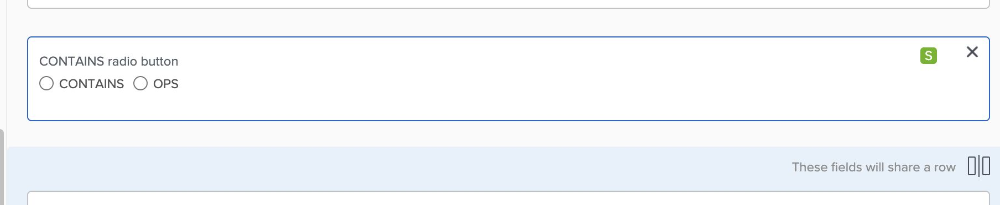

# 自訂欄位未顯示在表單上

## 說明 {#description}

### <b>環境</b>

Workfront

### <b>問題/症狀</b>

欄位已新增至自訂表單，但是，當您檢視表單時，該欄位不可見。

## 解決方法 {#resolution}

若要解決此問題，請執行以下步驟：

1. 確保欄位採用正確形式。
2. 檢查是否有分割槽符號。

   - 如果有分割槽符號，請檢查在區段中檢視欄位所需的存取許可權。                     
3. 檢查表單以取得略過邏輯。                                                                                                                                               
   - 實作「略過邏輯」時，其他區段會等待該「略過邏輯」啟動，以便隱藏這些區段/其他欄位。
   - 欄位上將會有「S」符號，表示欄位具有「略過邏輯」。
   - 如果跳過邏輯隱藏欄位，使用者需要填寫邏輯要觸發的必要欄位，或者您可能需要重新設定表單上的邏輯。

<b>相關讀數：</b>

- [使用舊版表單產生器新增顯示邏輯和略過邏輯至自訂表單](https://experienceleague.adobe.com/docs/workfront/using/administration-and-setup/customize/custom-forms/custom-form-builder/use-the-custom-form-builder/display-or-skip-logic-custom-form.html)
- [使用舊版表單產生器將分割槽符號新增至自訂表單](https://experienceleague.adobe.com/docs/workfront/using/administration-and-setup/customize/custom-forms/custom-form-builder/use-the-custom-form-builder/add-a-section-break-to-a-custom-form.htm)
