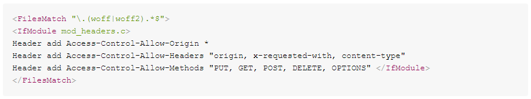

# 使用.woff和.woff2副檔名時，如何修正錯誤？

## 說明 {#description}


### 環境

Adobe Campaign Classic v7 （7.2.2版 — 版本編號9349）

### 問題/症狀

將.woff和.woff2放入mid執行個體白名單，並在Web應用程式中使用這些副檔名後，擲回以下錯誤：


```
Access to font at 'https://mkt-instance.campaign.adobe.com/res/mid-instance/file_example.woff2'
    from origin 'https://mkt-instance.campaign.adobe.com' has been blocked by 
    CORS policy: No 'Access-Control-Allow-Origin' header is present on the requested resource.
```


<u>要再現的步驟</u>:

1. 使用.woff和.woff2檔案存取網頁應用程式的URL。
2. 開啟網頁瀏覽器的瀏覽器主控台，並注意這些檔案的錯誤。


## 解決方法 {#resolution}


1. 新增 `Access-Control-Allow-Origin`， `Access-Control-Allow-Headers`、和 `Access-Control-Allow-Methods` 作為responseHeader，在 `serverConf.xml`：    
2. 新增 `Access-Control-Allow-Origin`， `Access-Control-Allow-Headers`、和 `Access-Control-Allow-Methods` 標頭於 `apache_neolane.conf` 在兩個應用程式容器上：    


### 原因

擲回錯誤，因為mid執行個體缺少 `Access-Control-Allow-Origin`， `Access-Control-Allow-Headers`、和 `Access-Control-Allow-Methods` 標頭於 `serverConf.xml` 及於 `apache_neolane.conf`.
