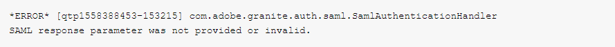

# SAML錯誤 — 未提供SAML回應引數或引數無效

## 說明 {#description}

### 環境

Adobe Experience Manager

### 問題/症狀

建立SAML 2.0設定以在生產作者上啟用SSO登入時，您收到來自AEM的錯誤訊息。 這是在Azure提供者執行登入並擷取SAML權杖以在AEM端執行驗證之後。

收到下列錯誤：

## 解決方法 {#resolution}

驗證SAML設定後，系統發現每當您嘗試登入AEM作者時，都會收到403錯誤。

如果未啟用Apache Sling反向連結篩選器，通常會顯示錯誤403。 在檢查Apache Sling查閱者篩選器的設定時，發現 <b>允許空白</b> 選項未核取，也沒有主機新增至 <b>允許主機</b>.

為了讓SAML登入能夠運作，身分提供者的主機名稱需要新增到Apache Sling反向連結篩選器OSGi設定。

因此，請核取 <b>允許空白</b>，並將代表IdP提供者的主機新增至 <b>允許主機</b>.

完成這些必要步驟後，登入成功。

<b>注意</b>：必須將IDP URL新增至Apache Sling反向連結篩選設定，不含通訊協定，例如 `aem-sso-saml` 而非 `https://aem-sso-saml`
