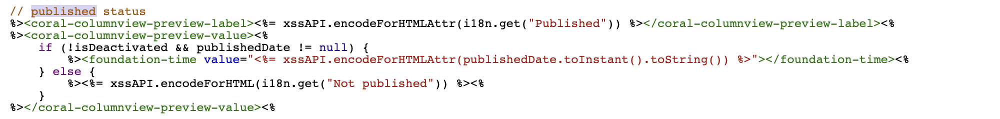

# Adobe Experience Manager：如何自訂Sites主控台上頁面發佈日期的顯示格式

## 說明 {#description}

AEM頁面發佈日期會顯示在網站主控台中，但不會顯示當日時間。
本節說明如何自訂已發佈日期的日期/時間格式，以包含當天時間。

<b>環境</b>
AEM 6.5、AEMas a Cloud Service

## 解決方法 {#resolution}

為每個欄和清單檢視建立覆蓋。

若為欄檢視，/libs/cq/gui/components/coral/admin/page/columnpreview/columnpreview.jsp會重疊。
  變更前

之後：將type=&quot;datetime&quot;屬性新增至foundation-time標籤。

若為清單檢視，/libs/cq/gui/components/coral/admin/page/row/row.jsp會重疊。
  變更前

之後：將type=&quot;datetime&quot;屬性新增至foundation-time標籤。

