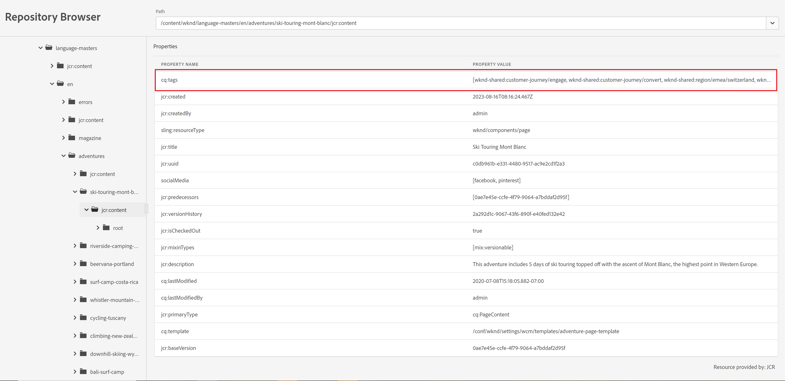

# 存放庫瀏覽器未顯示完整的屬性值

<b>環境:</b> <b>AEM 雲端服務</b>

<b>問題摘要：</b> 存放庫瀏覽器沒有顯示屬性的完整值，請參閱附加的熒幕擷圖

## 說明 {#description}

<b>要再現的步驟：</b> 前往環境的存放庫瀏覽器，並檢查某個節點是否具有含有大量值的屬性

<b>預期行為：</b> 屬性的所有值都應該可見

<b>經驗豐富的行為：</b>  屬性的值清單會被剪下。 無法選取專案，也無法捲動至右側。

## 解決方法 {#resolution}

透過內部Jira請求，此問題會回報為產品瑕疵。

作為因應措施，使用者可以透過新增&#39;來操作URL。-1.json&#39;在內容之後下載JSON檔案，這會使值可見 — 例如

https://author-pxxxxxx-eyyyyyy.adobeaemcloud.com/content/wknd/language-masters/en/adventures/ski-touring-mont-blanc/jcr:content.-1.json
