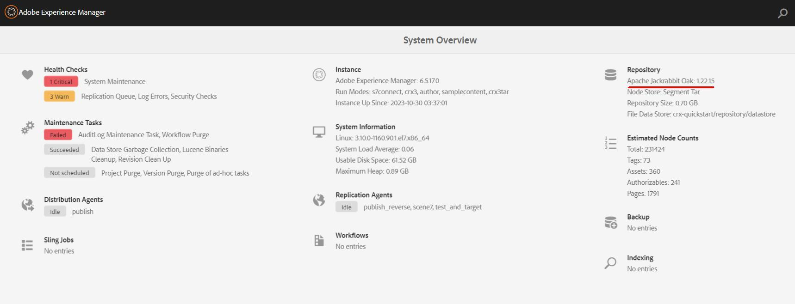

# 取得AEM版本的Oak-run工具的步驟

本文會說明如何根據AEM版本取得Oak-run工具。

## 說明 {#description}

### 環境

AEM 6.5

### 問題/症狀

本文會說明如何根據AEM版本取得Oak-run工具。

## 解決方法 {#resolution}

Oak-run工具在操作AEM時有各種使用案例，例如資料存放區一致性檢查及索引管理。      
1. 系統概覽，指定AEM中的Apache Jackrabbit Oak版本。
   
2. 存取[Oak-run存放庫。](https://repo1.maven.org/maven2/org/apache/jackrabbit/oak-run/)
3. 下載最新Oak-run工具，其中的Apache Jackrabbit Oak次要版本相同。

          範例： Apache Jackrabbit Oak： 1.22.15，使用1.22.x的最新Oak-run工具。