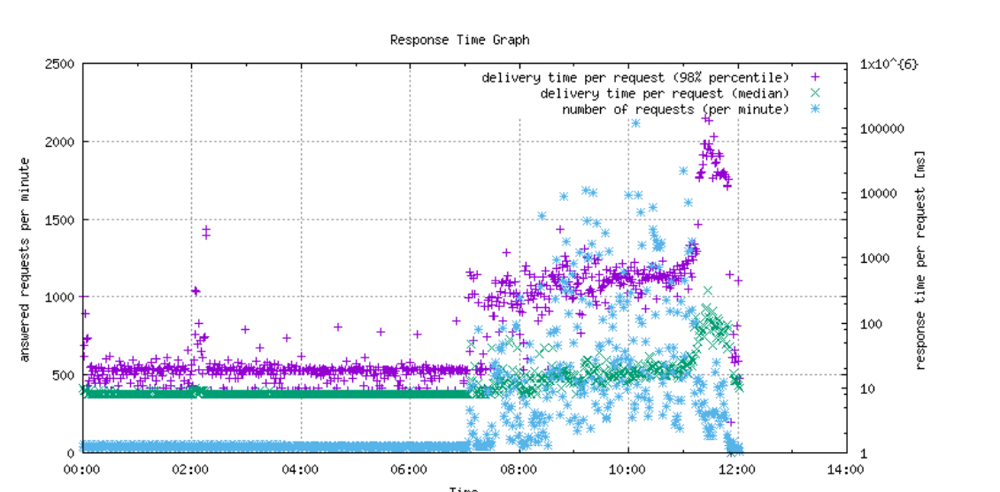

# 分析request.log檔案中的流量模式

下列步驟顯示如何分析 `request.log` 產生流量圖表，然後產生對輸出的交叉參照 `request.log` 和 `rlog.jar` 工具。

## 說明 {#description}

### <b>環境</b>

Adobe Experience Manager

### <b>問題/症狀</b>

如何分析 `request.log` 流量模式的檔案？

## 解決方法 {#resolution}

1. 安裝 <b>Perl </b>（為文字操作開發的程式語言）和 <b>Gnuplot </b>（可攜式命令列）在桌上型電腦上安裝，若是Windows作業系統，請安裝 <b>Cygwin </b>（類似Unix的環境和命令列介面）。

   安裝時 <b>Cygwin</b>，請務必包含 <b>Perl </b>和<b> Gnuplot</b> 安裝期間 <b>選取封裝 </b>步驟。 在Mac OS(X)上安裝 <b>Brew </b>（免費且開放原始碼的軟體套件管理系統）。

   安裝之後 <b>Brew</b>，開啟Mac終端機應用程式並執行 <b>Brew </b>以安裝 <b>Gnuplot</b>.
2. 將下列兩個檔案下載到電腦上的新資料夾。

   [graph-request-log.pl](https://raw.githubusercontent.com/joerghoh/cq5-utils/master/scripts/request.log/graph-request-log.pl)

   [requestlog.pm](https://raw.githubusercontent.com/joerghoh/cq5-utils/master/scripts/request.log/requestlog.pm)
3. 對以下專案的路徑執行命令： `request.log`： <b> </b>

   `Perl and graph-request-log.pl --title Request Log Graph --output output.png request.log | Gnuplot`。

   指令會產生一個名為的檔案 `output.png` 類似於以下內容：

若要瞭解上圖，必須瞭解 [中間值](https://www.mathsisfun.com/definitions/median.html) 和 [百分位數](https://www.mathsisfun.com/data/percentiles.html) 平均值。 如圖表所示，使用者直到上午7點左右才會使用系統。 流量會在上午9點左右恢復。 然後流量在上午11:30進一步增加，要求數量達到尖峰，而回應時間變慢（以中位數回應時間和第98個百分位標籤可見）。 檢視 [讀我檔案](https://github.com/joerghoh/cq5-utils/tree/master/scripts/request.log) 以取得此繪圖工具檔案的詳細資訊。

1. 現在圖表已用於尋找重要時段，請在記錄檔案（例如request.log和error.log）中交叉參照所選時間。 檢視大型檔案的一個簡單方法是使用 <b>[較少](https://en.wikipedia.org/wiki/Less_%28Unix%29)</b>shell上的命令(Windows上的Cygwin或Mac上的「終端機」)。 例如，執行此命令 <b>less request.log</b> 並搜尋 <b>/2016 11:3`[` 0-9`]` ：</b>，然後按下 <b>輸入</b> 以選取檔案中上午11:30的時間範圍，然後按一下「搜尋」。 
2. 圖形上的互動參照，對照圖形的輸出 `rlog.jar` 您也可以在opt/helpers底下執行AEM隨附的應用程式。 指示可在以下網址找到： [AEM檔案。](https://experienceleague.adobe.com/zh-hant/docs/experience-manager-release-information/aem-release-updates/previous-updates/aem-previous-versions)
