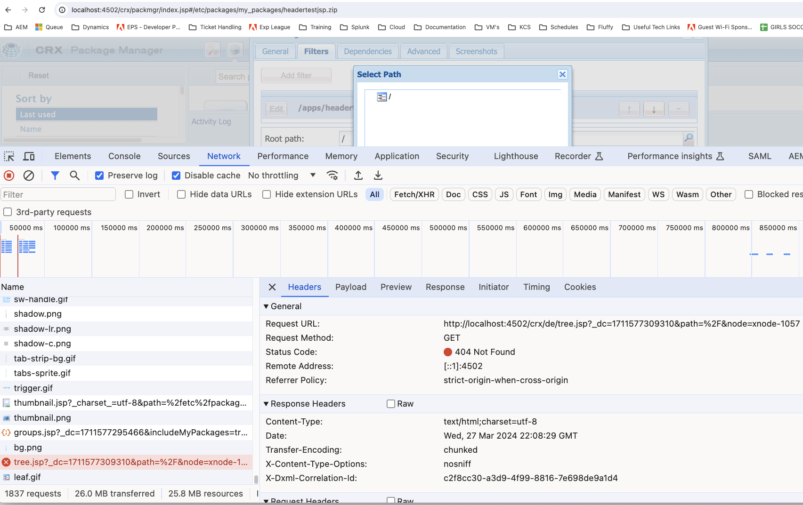

# 建立新篩選器時無法在封裝管理員中檢視子目錄

在Adobe Experience Manager (AEM)中，管理員在嘗試新增篩選器時，可能會遇到套件管理員UI中看不到子目錄的問題。 本文為需要建立包含子目錄的套件的使用者提供解決方案。

## 說明 {#description}

### 環境

Adobe Experience Manager (AEM)

### 問題

使用AEM封裝管理員為封裝建立新篩選器時，使用者介面可能只會顯示根目錄，以防止選取子目錄。

檢查此視窗後，您可以在瀏覽器開發人員工具中看到找不到/crx/de/tree.jsp檔案。

嘗試載入CRX/DE應用程式時，您也會看到類似錯誤(即 http://`<` hostname/crx/de/index.jsp)。

此行為可能會阻礙建立完整套件以供部署或散佈的能力。

## 解決方法 {#resolution}

若要解決此問題，請遵循下列步驟：

1. 前往您的組合(http://localhost:4502/system/console/bundles)。
2. 搜尋「crx」。
3. 確保 [AdobeGraniteCRXDE Lite(*com.adobe.granite.crxde-lite)*](http://localhost:4502/system/console/bundles/241) 套件組合正在執行中。
4. 重試使用案例。

您的CSE或許也可以暫時為您啟用此功能。

<b>注意：</b> AMS原則是停用生產系統上的CRX/DE套件組合。 在生產環境中啟用CRX DE Lite時，遵循安全性最佳實務至關重要。 應該將存取許可權製為必要的管理工作，而且總管在使用後應該立即停用。
