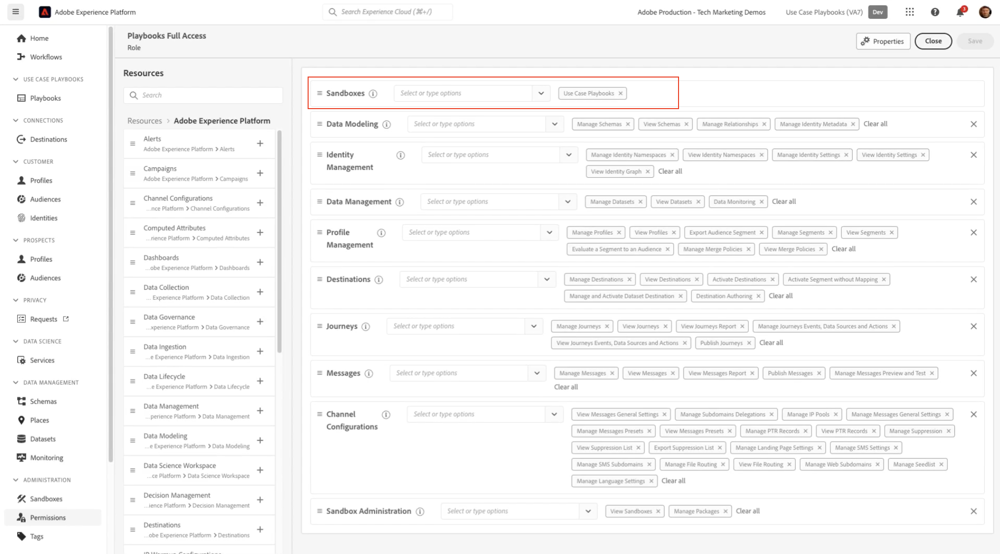

# Adobe Experience Platform使用案例教戰手冊功能表遺失

當 *使用案例教戰手冊* 您的Adobe Experience Platform沙箱中缺少功能表，請依照本文中的步驟進行存取。

## 說明 {#description}

### <b>環境</b>

Adobe Experience Platform

### <b>問題/症狀</b>

遵循Adobe Experience Platform檔案中的程式之後 *使用案例教戰手冊*，則 *教戰手冊* 連結在左側選單中不可見。

## 解決方法 {#resolution}

啟用此功能的步驟有2個。

1. 使用關鍵字建立沙箱 — <b>ucp</b> 在其中。 類似 *myorg-ucp。*
2. 請確定使用者擁有下列專案的許可權： *使用案例行動手冊* 功能

請參閱此連結以設定 *使用案例教戰手冊* 此處： [Adobe Experience Platform使用案例教戰手冊](https://experienceleague.adobe.com/en/docs/experience-platform/use-case-playbooks/playbooks/get-started)
