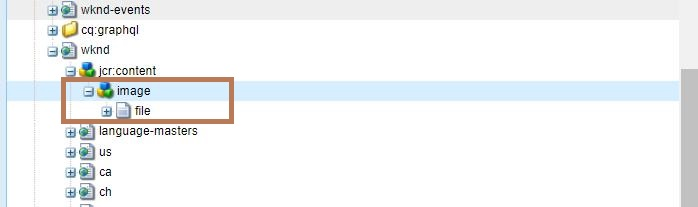

# Adobe Experience Manager：如何從頁面取消設定現有的縮圖

本文介紹將縮圖設定還原為預設的方法。

## 說明 {#description}

### <b>環境</b>

- Adobe Experience Manager as a Cloud Service
- Adobe Experience Manager 6.5

### 問題/症狀

雖然您可以變更已在頁面上設定的縮圖，但沒有直接選項可將其重設為預設值。

## 解決方法 {#resolution}

若要解決此問題，請刪除位於頁面路徑下方的/jcr：content/image節點。 例如，如果您刪除CRXDE Lite中的/content/wknd/jcr：content/image節點，WKND網站首頁的縮圖將恢復為預設值。

